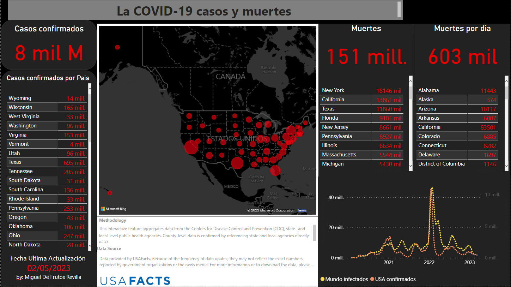

## Nombre del proyecto
Lugares y numero de casos - COVID19

## Vista previa

## Cómo usar
Si quieres visualizarlo, tan solo hay que hacer click en el link y acceder, alli puedes modificar filtros y visualizar los diferentes datos.

## Tecnologías utilizadas
Los lenguajes y herramientas utilizadas en este proyecto han sido:

- Power BI
- Python
- DAX
## Autor
[Miguel De Frutos](https://github.com/Migueldfr) fue el unico autor de este proyecto para visualizar los casos del covid

## Enlace al proyecto
Enlace al proyecto en PowerBI. Aquí te proporciono el link para acceder: [COVID_19 -- Empowered by POWER-BI](https://n9.cl/9ra90)

## Caso

Espero que esta plantilla te sea útil. ¡Buena suerte con tu proyecto en GitHub!